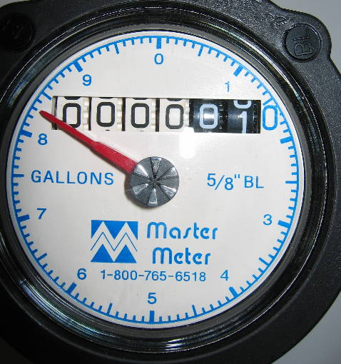

# Simple Scrolling Effects {#simple-usage}

TimeredCounter provides the following components for scrolling different types of data:

- [timered-counter-number](#number): `number`, `bigint`
- [timered-counter-datetime-duration](#datetime): `Date`
- [timered-counter-string](#string): `string`

You can achieve a nice scrolling effect with the default configuration.

::: tip
Click the <button class="border border-solid px-2 py-1">🔄</button> button to observe the change in values.
:::

## Scrolling Numbers {#number}

Imagine a water meter in real life, it keeps scrolling to show the current water usage. TimeredCounter can help you achieve this effect.

<figure>
  
  <figcaption class="text-xs italic"><a href="http://creativecommons.org/licenses/by-sa/3.0/" title="Creative Commons Attribution-Share Alike 3.0">CC BY-SA 3.0</a>, <a href="https://commons.wikimedia.org/w/index.php?curid=107725262">Link</a></figcaption>
</figure>

<DemoContainer title="Scrolling Numbers">
<BasicNumberDemo />

::: details Click to view code
::: code-group
<<< @/components/BasicNumberDemo.vue#html{html} [HTML]
<<< @/components/BasicNumberDemo.vue#js{js} [JS]
<<< @/components/BasicNumberDemo.vue{vue} [All]
:::
</DemoContainer>

## Countdown Effect {#datetime-duration}

I believe you have seen many countdowns, but most of them change abruptly without transitions. TimeredCounter can make your countdown effect smoother.

<DemoContainer title="Countdown Effect">
<BasicDatetimeDurationDemo />

::: details Click to view code
::: code-group
<<< @/components/BasicDatetimeDurationDemo.vue#html{html} [HTML]
<<< @/components/BasicDatetimeDurationDemo.vue#js{js} [JS]
<<< @/components/BasicDatetimeDurationDemo.vue{vue} [All]
:::
</DemoContainer>

## Scrolling Strings {#string}

Have you seen the moving title on the [homepage](/)? Such an effect can make your static web page more dynamic.

::: tip
Please note that the default configuration supports a maximum of **17** characters. If you need more characters, please refer to [how to remove the character length limit](../optional-dependencies.md#how-to-remove-character-length-limit).
:::

<DemoContainer title="Scrolling Strings">
<BasicStringDemo />

::: details Click to view code
::: code-group
<<< @/components/BasicStringDemo.vue#html{html} [HTML]
<<< @/components/BasicStringDemo.vue#js{js} [JS]
<<< @/components/BasicStringDemo.vue{vue} [All]
:::
</DemoContainer>

## Next Steps {#next}

- To learn how to set language-sensitive number formats, date and time formats, check out [Localization](locale-usage.md).
- If you want to customize the appearance or transition animations of the components, check out [Custom Styles](styled-usage.md) and [Custom Animations](animated-usage.md).
